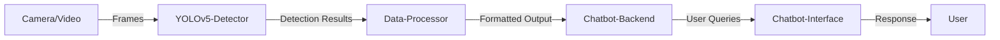

# Object Detection with YOLOv5 and Chatbot Integration

A cutting-edge project that combines state-of-the-art YOLOv5-based object detection with an intelligent chatbot backend to provide real-time interactive feedback and automation.

## Table of Contents

- [Project Overview](#project-overview)  
- [Key Features](#key-features)  
- [Technology Stack](#technology-stack)  
- [Architecture](#architecture)  
- [Installation](#installation)  
- [Usage](#usage)  
- [How It Works](#how-it-works)  
- [Customization](#customization)  
- [Use Cases](#use-cases)  
- [Contributing](#contributing)  
- [License](#license)  
- [Contact](#contact)  

---

## Project Overview

This project leverages the powerful YOLOv5 deep learning model to perform real-time object detection on video streams or images. The detection results are then integrated with a chatbot system, enabling intelligent interaction based on detected objects.

This unique fusion allows users not only to detect and track objects but also to query and receive contextual responses or automate workflows through the chatbot interface.

---

## Key Features

- **Real-Time Object Detection:** Uses YOLOv5 for fast and accurate detection across multiple object classes.
- **Multi-Object Tracking:** Supports detection and tracking of several objects simultaneously.
- **Chatbot Integration:** The detected objects are fed to a chatbot backend that processes queries, answers questions, and provides guidance or actions based on visual data.
- **Clipboard-based Interaction:** User can copy detected object data and interact via a chatbot GUI.
- **Extensible Design:** Easily extendable with additional detection classes and chatbot commands.
- **Cross-Platform Compatibility:** Runs on Windows, Linux, and macOS with minimal setup.

---

## Technology Stack

- **Python 3.11:** Primary programming language.
- **YOLOv5:** State-of-the-art object detection model based on PyTorch.
- **OpenCV:** For video capture, frame processing, and visualization.
- **PyTorch:** Deep learning framework used to run YOLOv5.
- **Custom Chatbot Backend:** NLP and AI-powered chatbot integrated with object detection results.
- **Clipboard Library:** Enables seamless copying and pasting of detected data.
- **GUI Framework:** Provides user interface for chatbot interaction and visualization (could be Streamlit, Tkinter, or custom).

---

## Architecture



---

## Installation

Clone the repository:

```bash
git clone https://github.com/nabeelalikhan0/Object-Detection-with-yolov5.git
cd Object-Detection-with-yolov5
```

Create and activate a virtual environment:

```bash
python -m venv venv
source venv/bin/activate   # On Windows: venv\Scripts\activate
```

Install dependencies:

```bash
pip install -r requirements.txt
```

Download YOLOv5 weights:

You can download pretrained weights from the official YOLOv5 repo or automatically via scripts included.

---

## Usage

Run the main script for object detection and chatbot integration:

```bash
python main.py
```

### Options

Use command-line flags or config files to specify:

- Input source (camera, video file, images)
- Classes to detect
- Chatbot backend parameters
- Output visualization preferences

---

## How It Works

1. The system captures video frames in real-time.
2. YOLOv5 processes each frame to detect objects, outputting bounding boxes, labels, and confidence scores.
3. Detected object data is sent to the chatbot backend.
4. The chatbot can:
   - Answer user queries related to detected objects.
   - Provide automated actions or information.
   - Store or export detection logs.
5. User interacts with the chatbot via a graphical interface, allowing queries based on the visual scene.

---

## Customization

- **Add New Object Classes:** Train YOLOv5 on custom datasets or add existing COCO classes.
- **Extend Chatbot:** Integrate additional NLP modules or APIs to enhance chatbot intelligence.
- **Improve UI:** Customize or switch the chatbot interface framework.
- **Integration:** Connect to other systems (IoT devices, databases) for automated workflows based on detection.

---

## Use Cases

- Security monitoring with intelligent alerts.
- Retail analytics and inventory management.
- Robotics and automation.
- Educational tools demonstrating AI and NLP fusion.
- Accessibility aids with voice or text interaction based on object detection.

---

## Contributing

Contributions are welcome! Please fork the repo and submit pull requests for bug fixes, feature additions, or improvements.

---

## License

This project is licensed under the MIT License. See the LICENSE file for details.

---

## Contact

Created by **Nabeel Ali Khan** – [GitHub](https://github.com/nabeelalikhan0)  
Feel free to reach out for questions, feedback, or collaboration opportunities.
